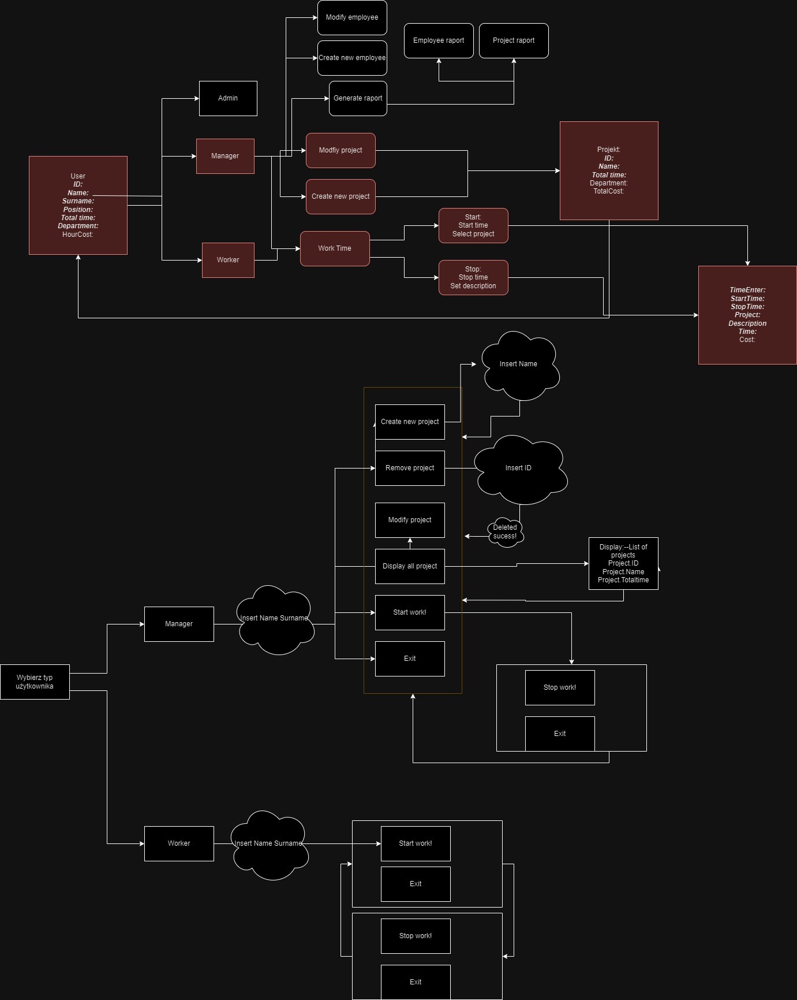

# Project clock

Project clock is a concise program designed to facilitate the tracking of time dedicated to different projects. Whether you're a freelancer, a developer, or anyone juggling multiple tasks, this tool is crafted to help you monitor and analyze your work hours with ease. 

## Features Project Management: 
- Create, edit, and delete projects to efficiently organize your workload. 
- Time Logging: Record start and end times for tasks, ensuring accurate timekeeping. 
- Reports and Analytics: Access detailed reports to analyze your productivity and identify areas for improvement.

## Our team:
- Tymoteusz Micherda - Mentor and Trainer
- Tomasz Żukowski - Team Leader
- Grzegorz Sajewicz - Scrum Master
- Robert Nizio - C# Developer

## First idea:

